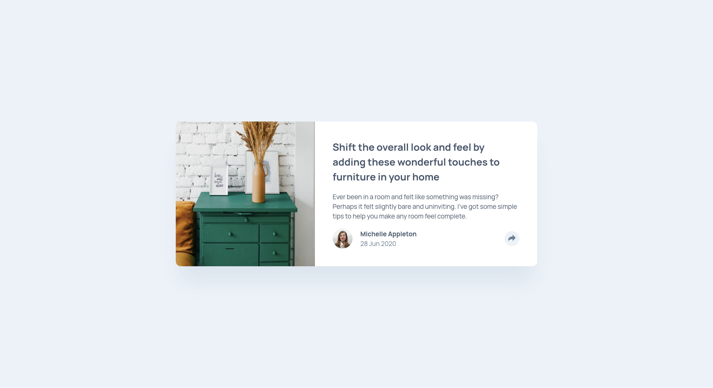

# Frontend Mentor - Article preview component solution

This is a solution to the [Article preview component challenge on Frontend Mentor](https://www.frontendmentor.io/challenges/article-preview-component-dYBN_pYFT). Frontend Mentor challenges help you improve your coding skills by building realistic projects.

## Table of contents

- [Overview](#overview)
  - [The challenge](#the-challenge)
  - [Screenshot](#screenshot)
  - [Links](#links)
- [My process](#my-process)
  - [Built with](#built-with)
  - [What I learned](#what-i-learned)
  - [Continued development](#continued-development)
  - [Useful resources](#useful-resources)
- [Acknowledgments](#acknowledgments)

**Note: Delete this note and update the table of contents based on what sections you keep.**

## Overview

### The challenge

Users should be able to:

- View the optimal layout for the component depending on their device's screen size
- See the social media share links when they click the share icon

### Screenshot

### Links

- Solution URL: [Article Preview Component](https://www.frontendmentor.io/solutions/article-preview-component-using-htmlscss-and-js-4w7osEiIAH)
- Live Site URL: [Article Preview Component](https://fem-article-preview-component-ecru.vercel.app/)

## My process

### Built with

- Semantic HTML5 markup
- CSS custom properties
- Flexbox
- Mobile-first workflow
- [Vite] - build tool
- SCSS and BEM

### What I learned

- Learned to position external divs anywhere in the page.
- Learned to use simple javascript actions like catching the events and styling the elements based on that.
- Learned how to use svg's and style them individually.

### Continued development

- Want to dive deep into javascript now.
- Since I am comfortable with creating individual components now I want to create and explore different types elements that websites typically use
- Want to use DRY code as much as possible and see where I can share my code along in js files also.

### Useful resources

- [ChatGPT](https://www.chat.com) - Helped me with debugging so that I don't smash my head on the desk 😂
- [Stack Overflow](https://www.example.com) - JS related queries.
- [Change SVG color](https://nucleoapp.com/blog/post/change-svg-color-css) - An article I found for styling svg's

## Acknowledgments

This is where you can give a hat tip to anyone who helped you out on this project. Perhaps you worked in a team or got some inspiration from someone else's solution. This is the perfect place to give them some credit.

- [a-d14](https://github.com/a-d14/article-preview-frontend-mentor) - I used some of his code to style the share popup button because I couldn't figure out how to style it and position it in my page. He has written simple and clear code.
